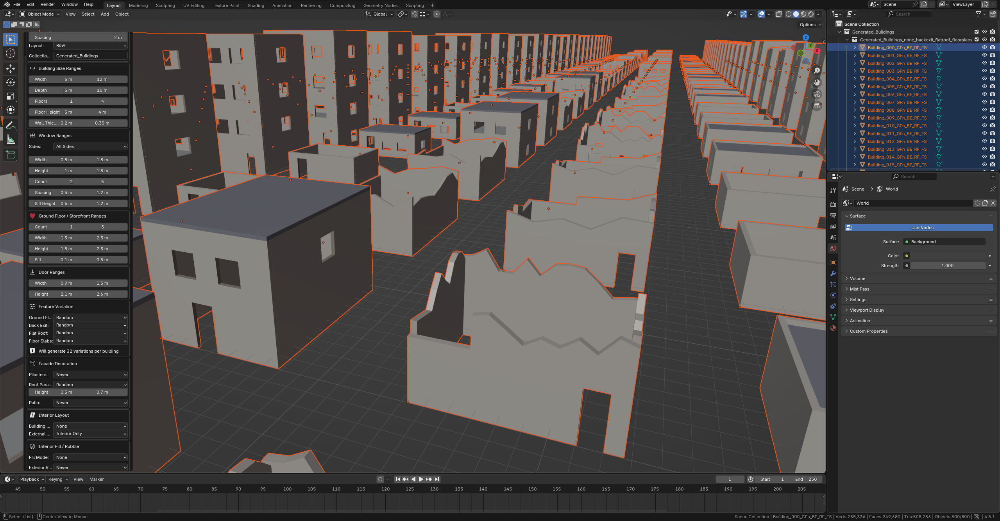

# Procedural Building Shell Generator

A Blender 4.5+ addon for generating game-ready building shells with customizable windows, doors, and optional post-apocalyptic damage. Perfect for creating urban environments for games.

  

## Features

- **Procedural Building Generation** - Create 1-10 floor urban building shells with a single click
- **Customizable Windows & Doors** - Control window types, sizes, spacing, and door placement
- **Storefront Mode** - Large display windows for ground floor retail spaces
- **Interior Layouts** - Optional room divisions, stairs, and multiple building profiles (Storefront, Warehouse, Residential, Bar)
- **Damage System** - Post-apocalyptic weathering with irregular edges and wall collapses
- **Facade Decoration** - Pilasters, roof parapets, and patios
- **Bulk Generation** - Generate multiple buildings with randomized parameters
- **Game-Ready Output** - Clean geometry with proper normals and UV seams
- **Material Slots** - Pre-configured slots for easy texturing

## Installation

1. Download the latest release (zip file)
2. In Blender, go to **Edit → Preferences → Add-ons**
3. Click **Install...** and select the downloaded zip file
4. Enable "Procedural Building Shell Generator" in the add-ons list

Or manually copy the `procedural_building_shell` folder to your Blender addons directory:
- **Windows**: `%APPDATA%\Blender Foundation\Blender\4.5\scripts\addons\`
- **macOS**: `~/Library/Application Support/Blender/4.5/scripts/addons/`
- **Linux**: `~/.config/blender/4.5/scripts/addons/`

## Quick Start

### Single Building
1. Press **Shift+A** → **Mesh** → **Procedural Building Shell**
2. Adjust parameters in the dialog
3. Click **OK** to generate

### Bulk Generation
1. Press **Shift+A** → **Mesh** → **Bulk Generate Buildings**
2. Set count, layout, and parameter ranges
3. Click **OK** to generate a collection of buildings

## Building Profiles

| Profile | Description |
|---------|-------------|
| **Storefront** | Retail front with back room, residential above |
| **Warehouse** | Large open space with optional office |
| **Residential** | Apartments with hallway |
| **Bar** | Multiple connected rooms for entertainment venues |

---

## Detailed Documentation

### Single Building Parameters

#### Basic Settings

| Parameter | Default | Description |
|-----------|---------|-------------|
| **Width** | 8.0m | Building width (X axis) |
| **Depth** | 6.0m | Building depth (Y axis) |
| **Floors** | 2 | Number of floors (1–4) |
| **Floor Height** | 3.5m | Height of each floor |
| **Wall Thickness** | 0.25m | Thickness of walls |

#### Window Settings

| Parameter | Default | Description |
|-----------|---------|-------------|
| **Window Type** | Rectangular | Style: Rectangular, Tall, or Square |
| **Window Width** | 1.2m | Width of each window |
| **Window Height** | 1.4m | Height of upper floor windows |
| **Windows Per Floor** | 3 | Number of windows on front/back walls |
| **Window Spacing** | 0.8m | Space between windows |
| **Sill Height** | 0.9m | Height of window sill from floor |

#### Storefront Settings (Ground Floor)

| Parameter | Default | Description |
|-----------|---------|-------------|
| **Storefront Ground Floor** | ✓ On | Enable larger storefront windows on ground floor |
| **Storefront Window Height** | 2.2m | Height of storefront windows |
| **Storefront Sill Height** | 0.3m | Lower sill for display windows |

#### Door Settings

| Parameter | Default | Description |
|-----------|---------|-------------|
| **Door Width** | 1.2m | Width of doors |
| **Door Height** | 2.4m | Height of doors |
| **Front Door Position** | 0.1 | Position along front wall (0=left, 1=right) |
| **Back Exit** | ✓ On | Add a back exit door |
| **Back Door Position** | 0.5 | Position along back wall |

#### Structure Options

| Parameter | Default | Description |
|-----------|---------|-------------|
| **Flat Roof** | ✓ On | Generate a flat roof |
| **Floor Slabs** | ✓ On | Generate floor slabs between floors |

> **Note:** When **Flat Roof** is disabled, walls automatically get top caps to close the geometry.

#### Damage Settings (Post-Apocalyptic)

| Parameter | Default | Description |
|-----------|---------|-------------|
| **Enable Damage** | Off | Master toggle for damage effects |
| **Face Deletion** | 0.0 | Probability of randomly deleting faces (0–0.5) |
| **Wall Section Removal** | 0.0 | Intensity of removing vertical wall sections |
| **Edge Noise** | 0.0m | Random vertex displacement for worn edges |
| **Broken Floors** | 0.0 | Probability of floor/roof damage |

#### Generation Settings

| Parameter | Default | Description |
|-----------|---------|-------------|
| **Random Seed** | 0 | Seed for deterministic generation |
| **Auto Clean** | ✓ On | Remove doubles, dissolve unnecessary edges, recalculate normals |
| **Create Material Slots** | ✓ On | Create material slots for easy texturing |

---

### Bulk Generation

Generate multiple buildings at once with randomized parameters.

#### Bulk Settings

| Parameter | Default | Description |
|-----------|---------|-------------|
| **Building Count** | 5 | Number of buildings to generate |
| **Spacing** | 2.0m | Space between buildings |
| **Layout** | Row | Arrangement: Row, Grid, or Random |
| **Grid Columns** | 3 | Columns when using Grid layout |
| **Random Area Size** | 50m | Area size when using Random layout |
| **Collection Name** | Generated_Buildings | Name of the collection for buildings |

#### Parameter Ranges

Define min/max values for randomized parameters:

| Range | Default Min | Default Max |
|-------|-------------|-------------|
| **Width** | 6.0m | 12.0m |
| **Depth** | 5.0m | 10.0m |
| **Floors** | 1 | 4 |
| **Floor Height** | 3.0m | 4.0m |

Buildings are generated with random values within these ranges, each with a unique seed based on the **Base Seed** + building index.

---

### Material Slots

When **Create Material Slots** is enabled, the addon creates 5 material slots:

| Slot | Material Name | Default Color | Usage |
|------|---------------|---------------|-------|
| 0 | Building_Walls | Concrete (tan) | Exterior walls |
| 1 | Building_Floor | Gray | Floor slabs |
| 2 | Building_Roof | Dark gray | Roof |
| 3 | Building_WindowFrame | Brown | Window frame edges |
| 4 | Building_DoorFrame | Dark brown | Door frame edges |

Replace these placeholder materials with your own textures for production use.

---

### Building Styles

#### Small Storefront (Default)
- 2 floors, 8×6m footprint
- Storefront mode enabled
- Door offset to the left (0.1)
- Large ground floor windows, smaller upper floor windows

#### Residential Apartment
- Disable "Storefront Ground Floor"
- Increase floors to 3-4
- Center the front door (offset 0.5)
- Uniform window sizes across all floors

#### Abandoned/Damaged Building
- Enable damage
- Face Deletion: 0.05–0.15
- Wall Section Removal: 0.3–0.5
- Edge Noise: 0.05–0.1m
- Broken Floors: 0.2–0.4

#### City Block (Bulk Generation)
- Use Bulk Generate with Grid layout
- 9–16 buildings (3×3 or 4×4 grid)
- Vary floors 1–4, widths 6–15m
- Enable storefront for ground floors
- Optional light damage for post-apocalyptic feel

---

### Tips

#### Deterministic Generation
- Use the **Random Seed** to get consistent results
- Same seed + same parameters = same building
- For bulk generation, Base Seed determines all building variations

#### Geometry Quality
- **Auto Clean** merges duplicate vertices and dissolves unnecessary edges
- Walls have proper thickness (inner + outer faces)
- Opening frames show wall depth at windows/doors
- Walls get top caps when no roof is generated

#### Performance
- Single buildings generate in under 5ms
- Bulk generation is efficient (no modifiers or booleans)
- Geometry is optimized with edge dissolution

#### Game Engine Export
- Geometry is clean and manifold (when Auto Clean is on)
- Normals face outward
- Separate material slots for easy texturing
- Export via **File → Export → FBX** (or your preferred format)

#### Customization Workflow
1. Generate building(s) with desired parameters
2. Apply materials/textures to each slot
3. Optionally apply modifiers (Bevel, Subdivision) for higher detail
4. Export to game engine

---

### Troubleshooting

#### Windows Overlapping or Missing
- Reduce **Windows Per Floor** or increase building **Width**
- Increase **Window Spacing**
- Windows automatically avoid door positions

#### Door Not Visible
- Ensure **Door Height** is less than **Floor Height**
- Check **Front Door Position** isn't pushing door off the wall

#### Damage Looks Too Extreme
- Lower all damage probabilities
- Use subtle Edge Noise (0.02–0.05m) for weathering

#### Materials Not Appearing
- Ensure **Create Material Slots** is enabled
- Check viewport shading mode (Material Preview or Rendered)

#### Bulk Buildings Overlapping
- Increase **Spacing** value
- Use Grid layout for predictable arrangement
- Reduce parameter ranges so building sizes are more consistent

---

### Changelog

#### v0.2.0
- Added **Bulk Generate Buildings** operator
  - Row, Grid, and Random layouts
  - Parameter ranges for width, depth, floors, floor height
  - Generates buildings into a named collection
- Added **wall top caps** when roof is disabled
- Improved geometry cleanup (edge dissolution for cleaner meshes)
- Fixed floor connection seams

#### v0.1.0
- Initial release
- Procedural wall generation with window/door cutouts
- Storefront mode for ground floor
- Configurable damage system
- Material slot creation
- Full operator UI with organized parameter groups

---

## License

GPL-3.0-or-later - Compatible with Blender's licensing.

See [LICENSE](LICENSE) for details.

## Contributing

Contributions are welcome! Please feel free to submit issues or pull requests.

## Credits

Originally developed for **Ares**, a first-person boomer shooter game.
